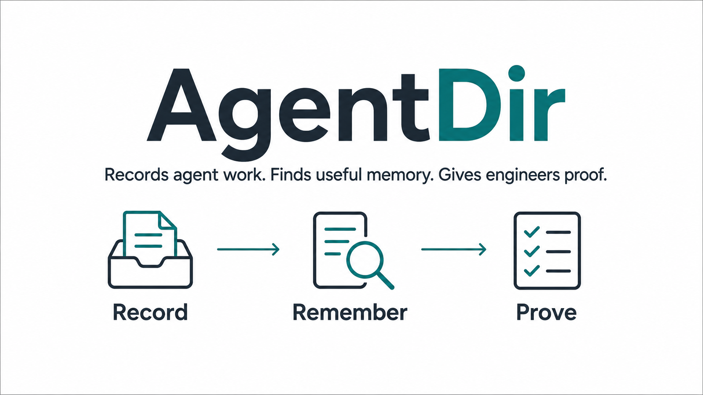

# AgentDir

<p align="center">
  
</p>

<p align="center">
  <strong>Local-first memory and evidence for agentic engineering.</strong>
</p>

AgentDir is a flight recorder for coding agents. It lets agents record what
happened during a software task, then gives engineers a clean way to inspect,
replay, search, and audit that work later.

The goal is simple: AgentDir should be nearly invisible while you work.

Engineers should not have to manually start sessions, wrap commands, collect
evidence, or maintain agent memory by hand. Once a repository is adopted, the
agent operates AgentDir in the background and leaves behind a useful trail.

## Why AgentDir Exists

Agentic engineering has a trust gap.

Agents can edit code, run tools, and summarize results, but their work often
ends up scattered across chat history, terminal scrollback, temporary files, and
unverified final claims. That makes it hard to answer basic questions:

- What did the agent actually do?
- Which commands support the final answer?
- Were tests, builds, lint, or release checks really run?
- What context did the agent retrieve and rely on?
- Can a future agent learn from this session?
- Can the index or memory layer be rebuilt if it breaks?

AgentDir gives those answers a local, durable home.

## What You Get

| Capability | What it means |
| --- | --- |
| Invisible agent workflow | Agents run AgentDir commands during normal work, so engineers keep using their coding assistant normally. |
| Evidence-backed claims | Test, build, lint, typecheck, doctor, and release claims can be checked against recorded tool results. |
| Replayable sessions | Inspect the task, decisions, commands, outputs, blockers, summaries, and handoffs after the fact. |
| Local-first storage | Records live in the repo-local `.agentdir` directory by default. No hosted service is required. |
| Rebuildable memory | Raw event files are the source of truth. SQLite search and memory indexes can be rebuilt. |
| Context lineage | Agents can emit context packs, then record which retrieved sources were consumed or cited. |
| Cross-repo memory | Explicitly registered AgentDir roots can be searched together without moving canonical records. |
| Secret-aware persistence | Common secret-like patterns are redacted before storage, with scan and cleanup commands for older records. |

## The Invisible Workflow

AgentDir is designed around a small separation of responsibility.

| Human does | Agent does |
| --- | --- |
| Install AgentDir once. | Start and finish AgentDir sessions. |
| Run `agentdir adopt` once per repo. | Capture evidence-bearing commands with `agentdir run`. |
| Ask the coding agent to do work. | Record decisions, blockers, context, and handoffs. |
| Inspect evidence only when needed. | Audit session quality and final claims before reporting. |

In day-to-day use, the human workflow stays the same:

```text
Ask the agent to do the task.
Review the result.
Use AgentDir only when you want the trail.
```

The agent handles the recording surface:

```bash
agentdir work start "fix checkout failure" --emit-context
agentdir run -- pytest -q
agentdir audit session
agentdir work finish --json
```

## Install

AgentDir is distributed through GitHub Releases. For the private
`jstxn/agentdir` repo, authenticate GitHub CLI first:

```bash
gh auth login
```

Install the latest release:

```bash
gh api -H "Accept: application/vnd.github.raw" \
  'repos/jstxn/agentdir/contents/scripts/install.sh?ref=v0.7.0' | bash
```

The installer uses `pipx` when available. Otherwise it creates a self-contained
virtual environment under `~/.local/share/agentdir` and links the CLI into
`~/.local/bin`.

Verify:

```bash
agentdir --version
agentdir --help
```

## Adopt A Repository

Run once from a git repository:

```bash
agentdir adopt
```

This is intentionally boring setup. It prepares the repository once, then agents
operate AgentDir during normal coding work:

- creates the repo-local `.agentdir` store
- installs AgentDir-managed git hook shims
- installs the Codex skill into the user skill directory
- writes managed project guidance for common agent tools
- runs `doctor` to confirm the store is healthy

After that, agents have the guidance they need to use AgentDir without the
engineer manually operating it during normal work.

Preview setup without writing anything:

```bash
agentdir adopt --dry-run --json
```

If you want generated integration files to stay inside the AgentDir store
instead of project instruction files:

```bash
agentdir adopt --install-skill store --install-generic store --integration-target store
```

Undo managed setup while keeping the `.agentdir` evidence store:

```bash
agentdir unadopt          # dry-run
agentdir unadopt --apply  # remove managed hooks and guidance
```

## What Gets Written

Default adoption writes only local files:

```text
<repo>/.agentdir/                         # evidence, artifacts, indexes, state
<repo>/.git/hooks/*                       # managed hook shims with backups
<repo>/AGENTS.md                          # generic / Codex-readable guidance
<repo>/CLAUDE.md                          # Claude Code guidance
<repo>/.github/copilot-instructions.md    # Copilot guidance
<repo>/.cursor/rules/agentdir.mdc         # Cursor guidance
<repo>/.windsurf/rules/agentdir.md        # Windsurf guidance
~/.codex/skills/agentdir/SKILL.md         # Codex skill, by default
```

Managed guidance is wrapped in AgentDir markers. Existing unmanaged content is
preserved where the target format supports managed blocks.

## Inspect A Session

Most users will not need these commands every day, but they are the reason
AgentDir exists.

```bash
agentdir status
agentdir evidence --brief
agentdir timeline
agentdir report final --format json
agentdir replay
agentdir memory search "checkout failure"
```

For final-answer support:

```bash
agentdir audit session
agentdir audit claims --text final-response.md
```

Audits are advisory by default. Use `--strict` when unsupported or contradicted
claims should fail a check.

## How AgentDir Works

AgentDir has one source of truth and several rebuildable views:

```text
raw envelopes -> SQLite index -> memory/search/audit/report
                    ^
                    |
             rebuilt from envelopes
```

1. **Raw envelopes**
   Each meaningful event is stored as an immutable file in a Maildir-inspired
   directory layout. These files are the source of truth.
2. **Derived indexes**
   SQLite indexes, search tables, memory passages, context packs, and audit
   views are derived from the raw event files and can be rebuilt.

Default project layout:

```text
<repo>/.agentdir/
  sessions/
  actors/
  artifacts/
  archives/
  indexes/agentdir.sqlite3
  state/
  integrations/
```

The important property is recoverability: deleting the derived index does not
destroy the session. AgentDir can rebuild from the envelope store.

The agent-facing report surface is JSON. `agentdir report final --format json`
and `agentdir work finish --json` include an `agent_handoff` object with
verification evidence, failed evidence, claim support, context lineage, known
gaps, and recommended next agent actions.

## Unique Capabilities

### Claims-To-Evidence Checks

AgentDir can compare final-response claims such as "tests passed" or "build
passed" against the latest recorded tool results. It does this with
deterministic heuristics, not an LLM.

Supported claim families:

- test
- lint
- typecheck
- build
- doctor
- release

### Context Packs

Agents can package retrieved context into auditable source manifests:

```bash
agentdir context build "checkout failure" --emit
agentdir context consume --pack <pack-id> --source <source-id> --purpose plan
agentdir context cite --pack <pack-id>
agentdir audit context --pack <pack-id>
```

This does not prove a model paid attention, but it does make cooperative agent
behavior visible.

### Local Agent Memory

AgentDir builds searchable local memory from prior sessions. Agents can search
similar work, explain why a memory hit matched, and include relevant history in
new context packs.

```bash
agentdir memory search "release evidence"
agentdir memory explain "release evidence"
agentdir context build "release evidence" --emit
```

Optional semantic extras exist, but the default path does not require a vector
database or external embedding service.

### Federated Memory

For multi-repo work, AgentDir can search explicitly registered roots:

```bash
agentdir roots register ../other-repo --name other-repo
agentdir memory search --federated "release evidence"
```

Each repository remains the canonical owner of its own `.agentdir` store.

## Safety Model

AgentDir is local-first and advisory by design.

- It records what agents choose to record.
- It does not replace code review or CI.
- It does not send data to a hosted AgentDir service.
- It treats raw envelopes as the source of truth.
- It redacts common secret-like patterns before persistence.
- It provides `secrets scan` and `secrets redact --apply` for cleanup.

Useful commands:

```bash
agentdir doctor
agentdir secrets scan
agentdir secrets redact
agentdir secrets redact --apply
```

## Upgrade And Rollback

Upgrade an existing install and refresh current repo adoption:

```bash
agentdir --upgrade
```

Rollback to the previous stable release:

```bash
gh api -H "Accept: application/vnd.github.raw" \
  'repos/jstxn/agentdir/contents/scripts/rollback.sh?ref=v0.7.0' | bash
```

## Learn More

- [Install Guide](docs/INSTALL.md)
- [Agentic Coding Guide](docs/AGENTIC_CODING.md)
- [Technical Brief](docs/TECH_BRIEF.md)
- [Release Guide](docs/RELEASING.md)
- [PRD](docs/PRD.md)

## Project Status

AgentDir is beta software for local-first agentic engineering workflows. The
core model is stable: agents operate the recorder, engineers get the evidence,
and raw local envelopes remain the recoverable source of truth.
